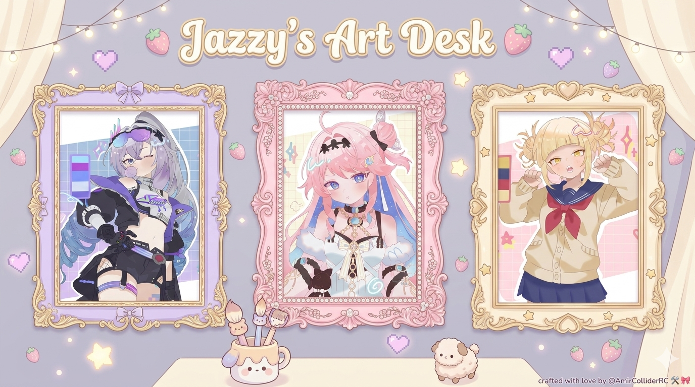
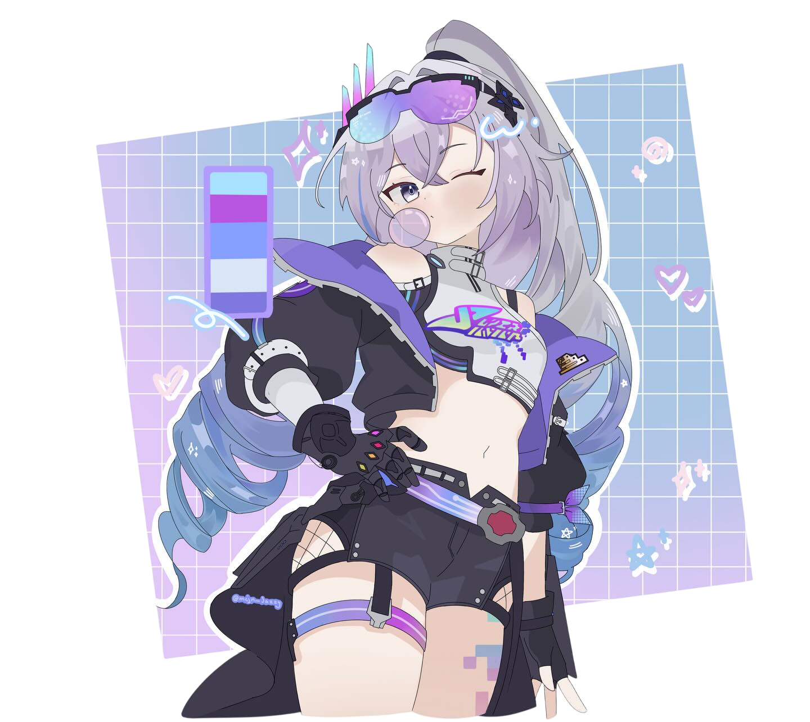
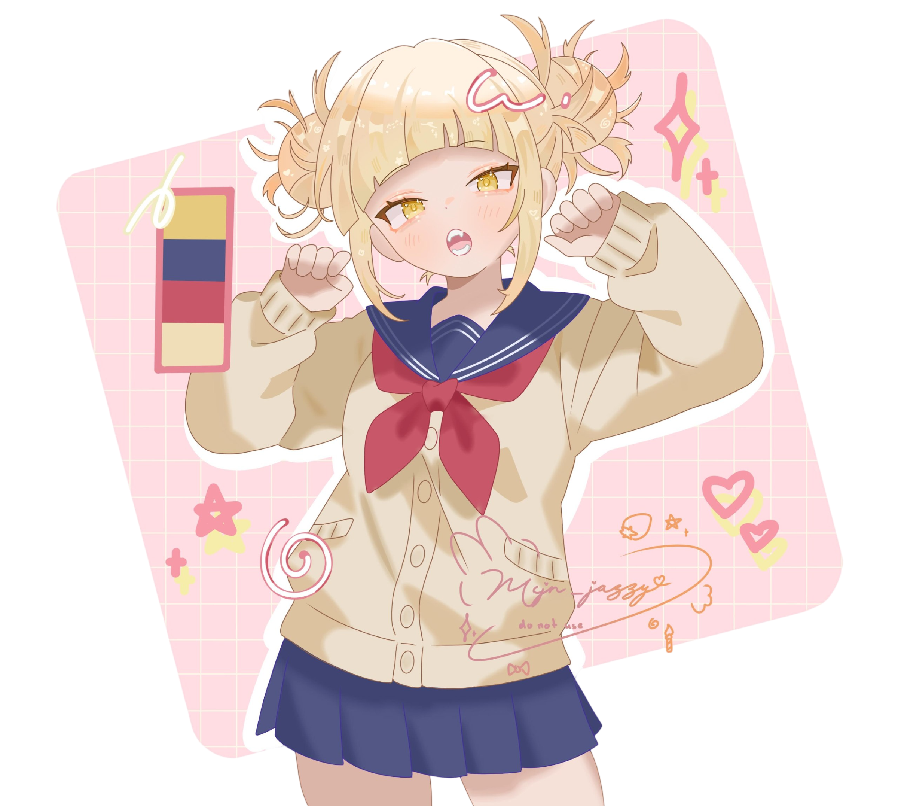
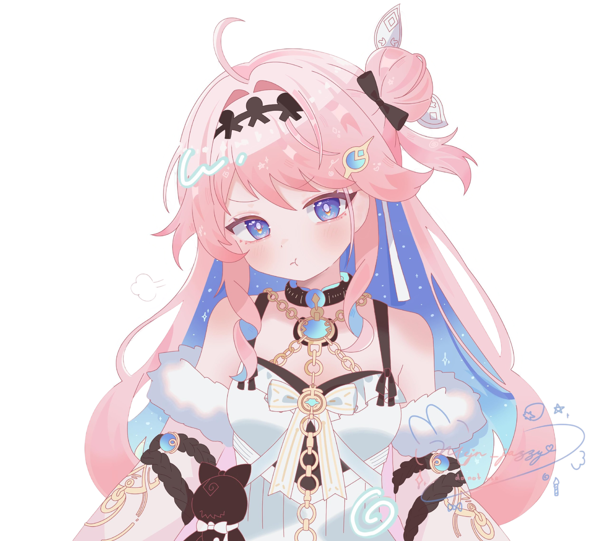

  

# 🍓 mcjn_jazzy · Commission Hub

*a cozy little corner where Jazzy shares her art — and takes commissions* 🌷

`cute` · `soft` · `anime-ish illustration`

---

## ✦ what is this?

A tiny, hand-made hub for the illustrator **`@mcjn_jazzy`** — part *artist id card*,
part *portfolio*, part *commission desk*. Visitors meet Jazzy, browse her art,
hop to her socials, and send a commission request that flies **straight to her
Telegram** with one tap.

It’s built to feel alive — floating doodles, a tilt-following ID card, glowing
trait badges, count-up stats, confetti, light & dark themes — and to be cheap and
fast on the edge.

---

## 🎨 a peek at the art

&nbsp;&nbsp;

---

## 🫧 features

- 🪪 **Artist ID card** — avatar, banner, live Instagram stats, glowing trait badges
- 🖼️ **Recent art** gallery with a click-to-zoom lightbox
- 🔗 **Little corners** — portfolio + social bridges
- 🍰 **Commission desk** — friendly form with honeypot spam protection
- 🕊️ **Instant Telegram delivery** with action buttons (done / reopen / view / DM / block / delete)
- 🌗 **Light & dark** themes (remembers your choice)
- ✨ **Alive everywhere** — parallax doodles, 3D tilt, sweeps, confetti, count-ups
- 📷 **Auto Instagram counts** (optional, via the Graph API)

---

## 🧁 tech stack

| Layer | What |
|------|------|
| Frontend | Vanilla **HTML / CSS / JS** — no framework, no build step |
| Hosting | **Cloudflare Pages** |
| Backend | **Pages Functions** (`/functions/api/*`) |
| Storage | **Cloudflare KV** (commissions, blocklist, IG cache) |
| Bots / APIs | **Telegram Bot API** · **Instagram Graph API** |

---

## 🗂️ structure
.

├── index.html            # page shell & structure

├── styles.css            # theme tokens, layout, animations

├── app.js                # UI, form, theme, tilt, confetti

└── functions/api/

├── _shared.js        # helpers (Telegram, cards, KV, blocklist)

├── commission.js     # POST /api/commission  → store + notify

├── telegram.js       # POST /api/telegram     → bot webhook

└── igstats.js        # GET  /api/igstats       → live IG counts

---

## 🤖 the bot

Private to Jazzy. Each project arrives as a card she can act on:

| Command | Does |
|--------|------|
| `/projects` | counts + filter buttons |
| `/active` · `/done` | list by status |
| `/block @user` · `/unblock @user` | stop / allow a sender |
| `/blocked` | list blocked people |
| `/id` · `/help` | utilities |

On every card: ✅ done · ↩️ reopen · 👁 view · 💬 DM · 🚫 block · 🗑 delete.

---

made with 🍓 by **AmirCollider** for **jazzy** · June 2026

